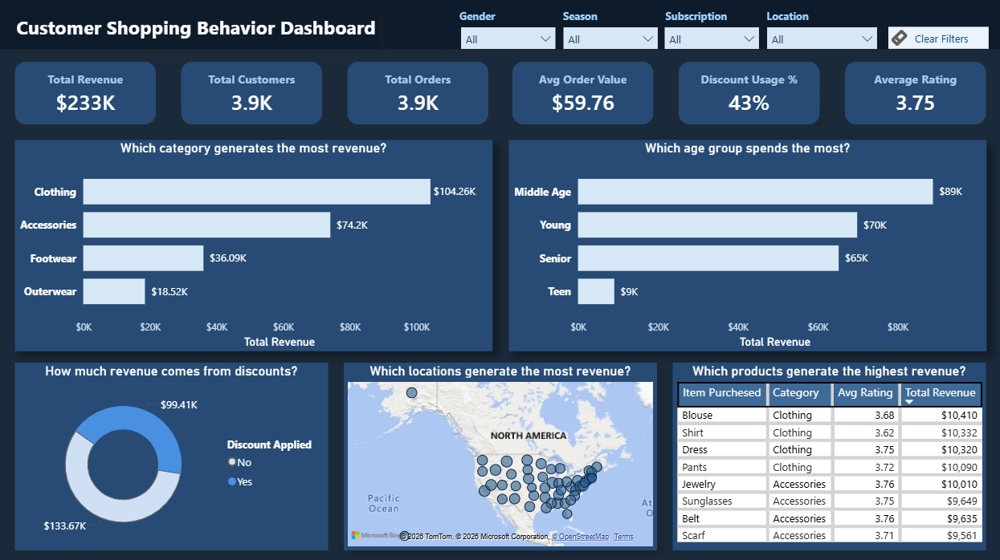

# 🛒 Customer Shopping Behaviour Analysis

## 📌 Project Overview
This project analyzes customer shopping data to understand how different factors like age, gender, season, discounts, and location affect sales.

The main goal is to move from raw data to clear business insights and help improve decision-making.

---

## 🎯 Problem Statement
Businesses collect large amounts of customer data, but often do not use it effectively to understand buying behavior.

This project focuses on identifying:
- Who are the most valuable customers  
- What products drive revenue  
- How discounts and seasons affect sales  
- Where the business performs the best  

The aim is to convert data into useful insights that support better business decisions.

---

## 🛠️ Tools & Technologies
- **Python** → Data cleaning and preparation  
- **SQL** → Data analysis and business questions  
- **Power BI** → Dashboard and visualization  

---

## 🔄 Project Workflow

### 1. Data Cleaning (Python)
The raw dataset was cleaned and prepared before analysis:
- Handled missing values  
- Fixed incorrect data types  
- Standardized column names  
- Created **age_group** for better segmentation  
- Removed unnecessary columns  

👉 Output: Clean dataset ready for analysis  

---

### 2. Data Analysis (SQL)
SQL was used to answer key business questions:
- Revenue by gender, age group, and season  
- Customer spending behavior  
- Discount usage and impact  
- Top products and categories  
- Location-based performance  

👉 Output: Clear understanding of revenue drivers and customer behavior  

---

### 3. Dashboard (Power BI)
An interactive dashboard was built to present insights:
- KPIs: Total Revenue, Customers, Orders  
- Category and age group analysis  
- Discount and customer behavior insights  
- Location-based visualization (map)  
- Slicers for filtering data  

👉 Output: Easy-to-understand visual insights for decision-making  

---

## 📊 Key Insights

- Male customers generate more total revenue mainly due to higher customer count  
- Customers aged **35–55** contribute the highest revenue  
- Revenue is **consistent across all seasons**, with only small differences  
- Discounts are mostly used by customers aged **18–55**  
- **Clothing and Accessories** are the main revenue-generating categories  
- A small number of products and locations contribute most of the sales  

---

## 💡 Business Recommendations

- Focus on increasing customer count to improve overall revenue  
- Target middle-aged customers with personalized marketing campaigns  
- Maintain consistent marketing and inventory across all seasons  
- Use discounts strategically in high-impact categories  
- Promote top-performing products to maximize sales  
- Expand business in high-revenue locations  

---

## 📈 Dashboard Preview

---

## 📂 Project Structure

- **data/**
  - raw_customer_shopping_data.xlsx  
  - cleaned_customer_shopping_data.xlsx  

- **python/**
  - customer_shopping_eda.py  
  - customer_shopping_eda.pdf  

- **sql/**
  - customer_shopping_analysis.sql  

- **power_bi/**
  - customer_shopping_dashboard.pbix  
  - dashboard_screenshot.png  

- **report/**
  - customer_shopping_analysis.docx  
  - customer_shopping_analysis.pdf  
  - customer_shopping_analysis.pptx  

---

## 🚀 Project Outcome
This project shows how raw customer data can be cleaned, analyzed, and converted into meaningful insights using Python, SQL, and Power BI.

It demonstrates the full data analysis process from data preparation to business recommendations.

---
